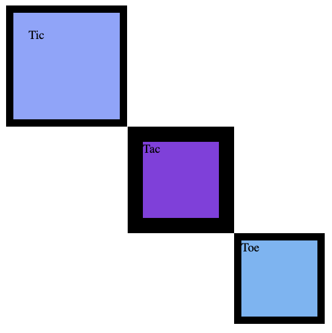

# CSS Box Model

## Background Info
- This activity focuses on understanding and implementing the CSS Box Model
- You will work with margins, borders, padding, and positioning to achieve the following appearance
.

## File Structure
- [css/style_boxes.css](css/style_boxes.css) - The CSS file where you'll implement the box model styling. (A template is provided, do not delete or change existing code)
- [index.html](index.html) - The main HTML file containing three div elements with classes: `top`, `middle`, and `bottom`

## Instructions
1. **Install dependencies**
    - Run `npm install` in the project directory to install required packages

2. **Run Live Server**
    - The webpage can be viewed using the Live Server extension, or with another method of your preference

2. **Edit CSS to achieve desired outcome**
    - Modify the [css/style_boxes.css](css/style_boxes.css) file to recreate the layout shown
    - The "Tic" box does not move. It remains in the top, left corner
    - The top left corner of the "Tac" box should touch the bottom right corner of the "Tic" box
    - The top left corner of the "Toe" box should touch the bottom right corner of the "Tac" box

3. **Run the tests locally**
    - Run `npm test` to verify correct implementation

4. **Submit once complete**
    - Push your working code to github once complete for grading