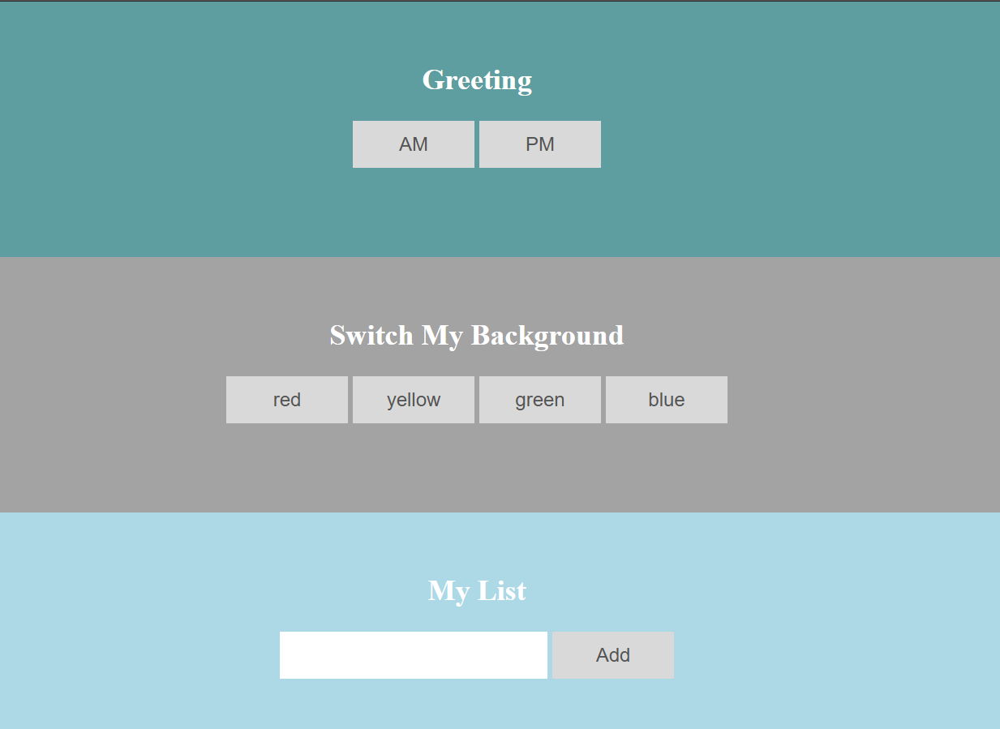
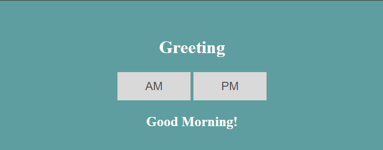
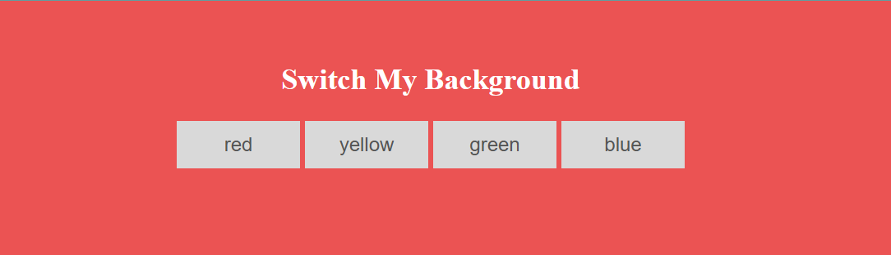
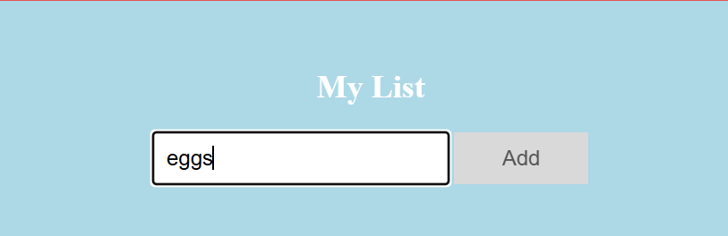
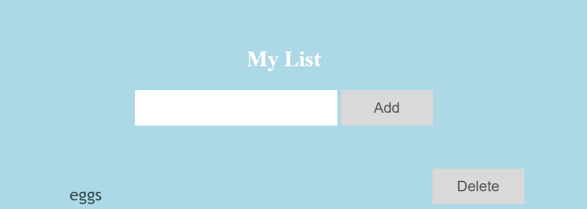
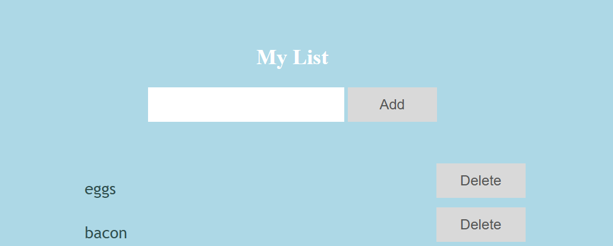
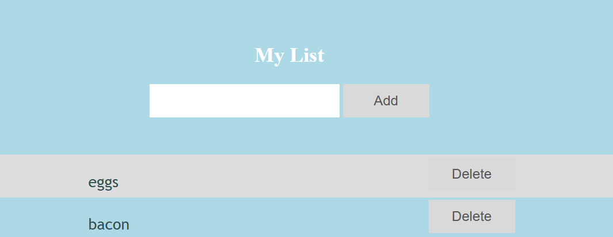
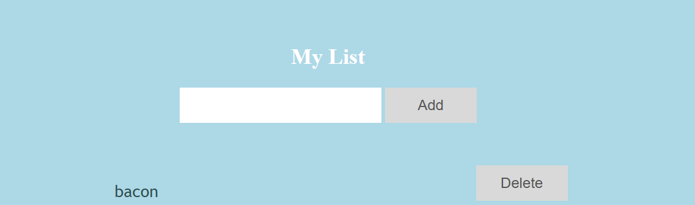

# JavaScript DOM Manipulation Project

This project focuses on manipulating the DOM using JavaScript. It includes three parts: a greeting that changes on a button click, a background color switcher, and a dynamic list that allows adding and removing items.

## Files Structure
- `index.html` - The main HTML file containing the structure for the three parts of the project.
- `css/style.css` - The CSS file for styling the project.
- `js/dom_js.js` - The JavaScript file where you will write the logic for DOM manipulation.

## Requirements

### Part 1: Greeting: Click Events Exercise (5 pts)
In the first div of the html (`div_greet`), you have two buttons, each with an id: 'am' and 'pm'. You also have an empty heading with id: ‘greeting’. The heading node is provided.

- Create a listener with `addEventListener` to invoke a callback on the click of each button.
- In the callback add appropriate text content to the heading node (`#greeting`).
  - When the am button is clicked, you should display “Good Morning!” in the heading.
  - When the pm button is clicked, you should display "Good Night!" in the heading.

> **Note:** Ensure the exact text "Good Morning!" and "Good Night!" is used.

### Part 2: Switch the Background Color (5 pts)
In the second div of the html (`div_color`), you have four buttons, each with an id: ‘red’, ‘yellow’, ‘green’ and ‘blue’. You also have four classes in the css: `bg_red`, `bg_yellow`, `bg_green`, and `bg_blue`. The buttons and classes are provided. You will provide the javascript to switch the color of the div on the click of the button.

- Add event listener(s) for the buttons with `addEventListener` which invoke a callback on click of each button.
- In the callback, set the class attribute of the containing div (`div_color`) to the appropriate color in the callback function. Use `setAttribute` to set the class attribute.

> **Note:** Ensure you use the exact class names `bg_red`, `bg_yellow`, `bg_green`, and `bg_blue`.

### Part 3: Create a dynamic list (10 pts)
In the third div of the html (`div_list`), you have an input box, a button and an empty unordered list. You are to add items to the list by taking the text entered into the input box when the button is clicked and inserting it along with a delete button into the list.

- Use `querySelector` and the id’s of the elements to reference the input box (`#usrInput`), button(`#addBtn`) and list (`#myUL`).
- Use `addEventListener` to invoke a callback on the click of the button.
- In the callback, get the user input from the `.value` property of the input box then clear the input box by setting the `.value` to an empty string (‘ ‘ ).
- Create the list item node and set the text of the list item to the user input.
- Create a button element and set its `textContent` to 'Delete'.
- Append the button to the list item.
- Append the new list item node to the unordered list.
- Create an event listener with `addEventListener()` to remove the new list item when the delete button is clicked.

> **Note:** When clicking the add button, item should not be added if the input box is empty.

**Example Flow:**
1. User enters text:
   
2. User clicks "Add":
   
3. Adding another item:
   
4. Deleting an item:
   
5. Item removed:
   

### Testing locally

You may run the test scripts locally by:

1. Install the tools by running:

   `npm install`

2. Run the test scripts:
   
   `npm test`

### Submit
Submit your completed project by pushing to the CSCI4300-Web-Programming organization.

  `git push`

** Do NOT issue a gh submit command.  This will trigger an additional run of the autograding scripts and consume our minutes.
